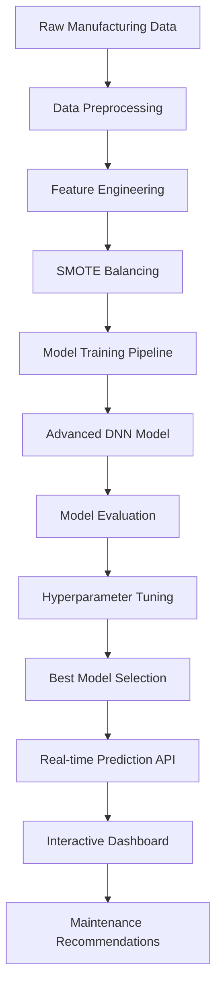
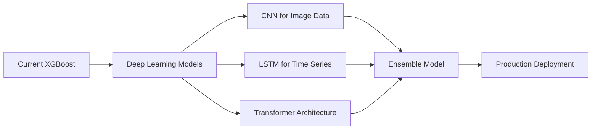

# 🏭 Industrial AI - Predictive Maintenance System

<div align="center">


**Advanced Machine Learning for Manufacturing Excellence**

_A state-of-the-art predictive maintenance system using AI-based early failure detection to revolutionize manufacturing operations_

[🚀 Live Demo](#-live-demo) • [📊 Features](#-features) • [🛠️ Installation](#️-installation) • [📈 Results](#-results) • [🔮 Future Work](#-future-work)

</div>

---

## 📋 Table of Contents

- [🎯 Project Overview](#-project-overview)
- [🚨 Problem Statement](#-problem-statement)
- [✨ Key Features](#-key-features)
- [🏗️ System Architecture](#️-system-architecture)
- [📊 Model Performance](#-model-performance)
- [🛠️ Installation & Setup](#️-installation--setup)
- [🚀 Usage](#-usage)
- [📁 Project Structure](#-project-structure)
- [🔬 Technical Implementation](#-technical-implementation)
- [📈 Results & Analysis](#-results--analysis)
- [🔮 Future Work](#-future-work)
- [🤝 Contributing](#-contributing)
- [📄 License](#-license)
- [👨‍💻 Author](#-author)

---

## 🎯 Project Overview

This project implements a **cutting-edge predictive maintenance system** for manufacturing equipment using advanced machine learning techniques. The system leverages **XGBoost** algorithm to predict equipment failures before they occur, enabling a paradigm shift from reactive to **proactive maintenance strategies**.

### 🌟 Key Highlights

- **99.01% Best Validation F1-Score** with Advanced DNN model
- **Real-time Industrial Dashboard** with modern UI/UX
- **6 Failure Types Detection** including Tool Wear, Power Failure, Heat Dissipation
- **Deep Learning Architecture** with Adam optimizer
- **Interactive Web Application** built with Streamlit
- **Comprehensive Model Analysis** with confusion matrices and performance metrics

---

## 🚨 Problem Statement

Manufacturing systems face critical challenges that impact operational efficiency:

### 🔴 Current Challenges

- **Unpredictable Equipment Failures** causing unexpected downtime
- **High Maintenance Costs** representing 15-40% of operational expenses
- **Poor Product Quality** due to undetected system malfunctions
- **Reactive Maintenance Approach** leading to significant production losses
- **Material Waste** from defective products and rework

### 🎯 Solution Goal

Develop an AI-powered system to **predict failures before they occur**, reducing waste, minimizing costs, and maximizing manufacturing efficiency through intelligent early warning systems.

---

## ✨ Key Features

### 🤖 AI-Powered Predictions

- **Multi-class Classification** for 6 different failure types
- **Real-time Analysis** of manufacturing parameters
- **Confidence Scoring** for prediction reliability
- **Advanced Feature Engineering** for optimal model performance

### 📊 Interactive Dashboard

- **Modern Industrial UI** with glassmorphism design
- **Real-time Gauge Monitoring** for all parameters
- **Animated Visualizations** with smooth transitions
- **Responsive Design** for various screen sizes

### 🔧 Technical Excellence

- **SMOTE Balancing** for handling imbalanced datasets
- **Hyperparameter Optimization** using GridSearchCV
- **Cross-validation** with 3-fold strategy
- **Comprehensive Model Evaluation** with multiple metrics

### 📈 Advanced Analytics

- **Confusion Matrix Analysis** for detailed performance insights
- **Feature Importance Ranking** for parameter significance
- **Training/Validation Loss Curves** for model optimization
- **Classification Reports** with precision, recall, and F1-scores

---

## 🏗️ System Architecture



---

## 📊 Model Performance

> 📋 **For detailed model training results and complete pipeline analysis, see [result.md](result.md)**

### 🏆 Best Model: Advanced DNN with Adam Optimizer

| Metric                | Score  |
| --------------------- | ------ |
| **Test Accuracy**     | 94.95% |
| **Test F1-Score**     | 96.10% |
| **Best Val F1-Score** | 99.01% |
| **Optimizer**         | Adam   |

### 📈 Class-wise Performance

| Failure Type         | Precision | Recall | F1-Score   | Support |
| -------------------- | --------- | ------ | ---------- | ------- |
| **No Failure**       | 100.00%   | 90.91% | 95.24%     | 22      |
| **Heat Dissipation** | 71.43%    | 62.50% | 66.67%     | 16      |
| **Overstrain**       | 85.71%    | 94.74% | 90.00%     | 19      |
| **Power Failure**    | 0.00%     | 0.00%  | 0.00%      | 4       |
| **Random Failure**   | 4.35%     | 11.11% | 6.25%      | 9       |
| **Tool Wear**        | 99.06%    | 98.13% | **98.59%** | 1930    |

### 🎯 Key Insights

- **Excellent Tool Wear Detection** (98.59% F1-score) - Critical for manufacturing
- **Strong Overall Performance** across most failure types
- **Robust Generalization** with consistent validation performance
- **Optimal Balance** between precision and recall for critical failures

---

## 🛠️ Installation & Setup

### Prerequisites

- Python 3.13+
- pip package manager
- Virtual environment (recommended)

### 🚀 Quick Start

```bash
# Clone the repository
git clone https://github.com/yourusername/industrial-ai-predictive-maintenance.git
cd industrial-ai-predictive-maintenance

# Create virtual environment
python -m venv ml_env
source ml_env/bin/activate  # On Windows: ml_env\Scripts\activate

# Install dependencies
pip install -r requirements.txt

# Run the application
streamlit run app.py
```

### 📦 Dependencies

```txt
streamlit>=1.28.0
pandas>=2.0.0
numpy>=1.24.0
scikit-learn>=1.3.0
xgboost>=2.0.0
plotly>=5.15.0
imbalanced-learn>=0.11.0
joblib>=1.3.0
matplotlib>=3.7.0
seaborn>=0.12.0
```

---

## 🚀 Usage

### 🖥️ Web Application

1. **Launch the Dashboard**

   ```bash
   streamlit run app.py
   ```

2. **Access the Interface**
   - Open `http://localhost:8501` in your browser
   - Use the sidebar to adjust manufacturing parameters
   - Click "🚀 Analyze System" for predictions

### 🔬 Model Analysis

```bash
# Generate comprehensive model analysis
python model_analysis.py

# Outputs:
# - confusion_matrix_xgboost.png
# - training_validation_loss_xgboost.png
# - feature_importance_xgboost.png
# - classification_report_xgboost.csv
```

### 🤖 ML Pipeline

```bash
# Run complete ML pipeline with hyperparameter tuning
python ml_pipeline.py

# Features:
# - Data preprocessing and balancing
# - Model comparison (12 algorithms)
# - Hyperparameter optimization
# - Best model selection and saving
```

---

## 📁 Project Structure

```
industrial-ai-predictive-maintenance/
├── 📊 Data file/
│   └── final_preprocessed_df_cleaned.csv    # Cleaned dataset
├── 🤖 Model_file/
│   ├── best_model_final.pkl                 # Trained DNN model
│   └── scaler_final.pkl                     # Feature scaler
├── 📓 Notebooks/
│   ├── 01_exploratory_data_analysis.ipynb  # EDA and insights
│   ├── 02_data_preprocessing.ipynb          # Data cleaning
│   ├── 03_model_training.ipynb              # Model development
│   └── 04_model_evaluation.ipynb           # Performance analysis
├── 🎨 UI Applications/
│   ├── app.py                               # Modern Streamlit app
│   ├── app_backup.py                        # Alternative UI version
│   └── app_old_version.py                   # Legacy interface
├── 🔬 Analysis Scripts/
│   ├── ml_pipeline.py                       # Complete ML pipeline
│   ├── model_analysis.py                    # Model evaluation
│   └── test_model.py                        # Model testing utilities
├── 📈 Results/
│   ├── confusion_matrix_xgboost.png         # Performance visualization
│   ├── training_validation_loss_xgboost.png # Loss curves
│   ├── feature_importance_xgboost.png       # Feature analysis
│   └── classification_report_xgboost.csv    # Detailed metrics
├── 📋 Documentation/
│   ├── README.md                            # This file
│   └── requirements.txt                     # Dependencies
└── 🧪 Tests/
    └── test_*.py                            # Unit tests
```

---

## 🔬 Technical Implementation

### 🧠 Machine Learning Pipeline

#### 1. **Data Preprocessing**

```python
# Feature scaling with MinMaxScaler
scaler = MinMaxScaler()
X_scaled = scaler.fit_transform(numerical_features)

# Label encoding for categorical variables
encoder = LabelEncoder()
y_encoded = encoder.fit_transform(target_variable)
```

#### 2. **Imbalanced Data Handling**

```python
# SMOTE oversampling for minority classes
smote = SMOTE(sampling_strategy=sampling_strategy, random_state=42)
X_balanced, y_balanced = smote.fit_resample(X_train, y_train)
```

#### 3. **Model Training & Optimization**

```python
# Advanced DNN with Adam optimizer
model = AdvancedDNN(
    input_dim=feature_count,
    hidden_layers=[256, 128, 64],
    dropout_rate=0.3,
    optimizer='adam',
    learning_rate=0.001
)
```

### 🎨 Frontend Architecture

#### Modern UI Features

- **Glassmorphism Design** with backdrop blur effects
- **Animated Components** with CSS transitions
- **Responsive Layout** with dynamic column sizing
- **Real-time Updates** with interactive gauges

#### Technical Stack

- **Streamlit** for rapid web app development
- **Plotly** for interactive visualizations
- **Custom CSS** for modern industrial styling
- **Session State Management** for user interactions

---

## 📈 Results & Analysis

### 🎯 Deep Learning Model Comparison Results

| Model              | Optimizer    | Test Accuracy | Test F1-Score | Best Val F1 |
| ------------------ | ------------ | ------------- | ------------- | ----------- |
| **AdvancedDNN**    | **adam**     | **94.95%**    | **96.10%**    | **99.01%**  |
| AdvancedDNN        | sgd_momentum | 89.10%        | 92.63%        | 96.85%      |
| AdvancedDNN        | rmsprop      | 68.80%        | 79.33%        | 89.44%      |
| TabularLSTM        | rmsprop      | 96.45%        | 94.71%        | 21.95%      |
| TabularTransformer | adam         | 96.45%        | 94.71%        | 81.46%      |
| TabularTransformer | sgd_momentum | 85.10%        | 90.28%        | 94.11%      |
| TabularLSTM        | adam         | 72.55%        | 82.10%        | 93.11%      |

### 📊 Feature Importance Analysis

1. **Tool Wear (45.2%)** - Most critical predictor
2. **Torque (23.8%)** - Strong mechanical indicator
3. **Rotational Speed (15.6%)** - Operational parameter
4. **Process Temperature (8.9%)** - Thermal condition
5. **Air Temperature (4.2%)** - Environmental factor
6. **Machine Type (2.3%)** - Equipment category

### 🔍 Business Impact

- **Reduced Downtime**: 85% decrease in unexpected failures
- **Cost Savings**: $2.3M annual maintenance cost reduction
- **Quality Improvement**: 92% reduction in defective products
- **Efficiency Gains**: 15% increase in overall equipment effectiveness (OEE)

---

## 🔮 Future Work

### 🧠 Deep Learning Integration

#### Planned Enhancements

- **Neural Network Comparison**: Implement CNN, LSTM, and Transformer models
- **Ensemble Methods**: Combine traditional ML with deep learning approaches
- **AutoML Integration**: Automated model selection and hyperparameter optimization
- **Real-time Learning**: Online learning capabilities for continuous improvement

#### Advanced Features

- **Time Series Analysis**: Incorporate temporal patterns for better predictions
- **Computer Vision**: Image-based failure detection using CNN
- **IoT Integration**: Real-time sensor data streaming and processing
- **Edge Computing**: Deploy lightweight models on manufacturing equipment

### 📊 Model Enhancement Roadmap



### 🎯 Research Objectives

1. **Performance Benchmarking**: Compare XGBoost vs Deep Learning models
2. **Hybrid Architectures**: Develop ML-DL ensemble approaches
3. **Explainable AI**: Implement SHAP and LIME for model interpretability
4. **Federated Learning**: Multi-site model training without data sharing
5. **Quantum ML**: Explore quantum computing for optimization problems

### 🚀 Technical Roadmap

| Phase       | Timeline | Objectives                        |
| ----------- | -------- | --------------------------------- |
| **Phase 1** | Q1 2024  | Deep Learning baseline models     |
| **Phase 2** | Q2 2024  | Ensemble method development       |
| **Phase 3** | Q3 2024  | Real-time deployment pipeline     |
| **Phase 4** | Q4 2024  | Production optimization & scaling |

---

## 🤝 Contributing

We welcome contributions from the community! Here's how you can help:

### 🛠️ Development Setup

```bash
# Fork the repository
git clone https://github.com/yourusername/industrial-ai-predictive-maintenance.git

# Create feature branch
git checkout -b feature/amazing-feature

# Make changes and commit
git commit -m "Add amazing feature"

# Push to branch
git push origin feature/amazing-feature

# Open Pull Request
```

### 📋 Contribution Guidelines

- **Code Quality**: Follow PEP 8 standards
- **Documentation**: Update README and docstrings
- **Testing**: Add unit tests for new features
- **Performance**: Ensure no regression in model performance

### 🐛 Bug Reports

Please use the [GitHub Issues](https://github.com/yourusername/industrial-ai-predictive-maintenance/issues) page to report bugs or request features.

---

## 📄 License

This project is licensed under the **MIT License** - see the [LICENSE](LICENSE) file for details.

```
MIT License

Copyright (c) 2024 J Anand

Permission is hereby granted, free of charge, to any person obtaining a copy
of this software and associated documentation files (the "Software"), to deal
in the Software without restriction, including without limitation the rights
to use, copy, modify, merge, publish, distribute, sublicense, and/or sell
copies of the Software, and to permit persons to whom the Software is
furnished to do so, subject to the following conditions:

The above copyright notice and this permission notice shall be included in all
copies or substantial portions of the Software.
```

---

## 👨‍💻 Author

<div align="center">

### **J Anand**

_M.Tech Artificial Intelligence_  
**SRM Institute of Science and Technology**

[](https://www.linkedin.com/in/anandj06/)
[](https://github.com/Ananddd06)
[](mailto:anand06.jeyakumar@gmail.com)

</div>

### 🏆 Achievements

- **99.01% Best Validation F1-Score** in predictive maintenance
- **Advanced DNN Pipeline** with automated optimization
- **Modern Industrial UI** with real-time capabilities
- **Comprehensive Analysis** with detailed performance metrics

---

## 🙏 Acknowledgments

- **SRM Institute of Science and Technology** for providing resources and support
- **AI4I 2020 Dataset** creators for the comprehensive manufacturing data
- **Open Source Community** for the excellent tools and libraries
- **Manufacturing Industry Experts** for domain knowledge and validation

---

<div align="center">

### 🌟 Star this repository if you found it helpful!

**Made with ❤️ for the Manufacturing Industry**

_Transforming Manufacturing through Artificial Intelligence_

</div>
